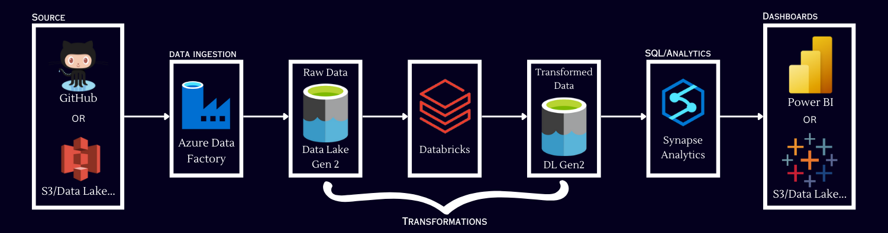

# Tokyo Olympics Data Analytics | Azure End-To-End Data Engineering Project 

## Description
Leveraging the Azure cloud, this project dives into the Tokyo Olympics data. Starting with Azure Data Factory for seamless ingestion, the data travels through Azure Data Lake Storage Gen2 and Azure Databricks for expert transformation. Advanced analytics in Azure Synapse unlock hidden insights, finally brought to life with stunning visualizations using Synapse and Power BI.

## Architecture 

## Dataset Used

Tokyo 2021 (2020) Olympics Dataset:
- Covers over 11,000 athletes from 743 teams.
- Includes info on athletes, coaches, teams, and event entries.
- Provides names, countries, disciplines, genders, and even coach names.
- Features details of participants across 47 different sports.
- Explore participation and representation across a wide range of nations and athletes.

Source(Kaggle): [2021 Olympics in Tokyo](https://www.kaggle.com/datasets/arjunprasadsarkhel/2021-olympics-in-tokyo)

## Azure Services Used
1. **Azure Data Factory:** For data ingestion from GitHub.
2. **Azure Data Lake Storage Gen2**: For data storage solution.
3. **Azure Databricks:** For data transformation tasks.
4. **Azure Synapse Analytics:** To perform in-depth data analytics.
5. **PowerBI:** To visualize the analysis by Synapse Integration. 

## Workflow 

## Initial Setup
1. Create a dedicated resource group named "tokyo-olympic-data" to act as a central hub for managing all project-related resources.
2. Set up a storage account within the resource group, specifically configured to harness the power of Azure Data Lake Storage (ADLS) Gen2.
3. Within the storage account
    - create a container to house the project's data.
    - Within this container, establish two distinct directories:
        - "raw-data": This directory will store the original, unprocessed data as it's ingested.
        - "transformed-data": This directory will hold the data after it has undergone any necessary transformations or cleaning processes.
 

## Data Ingestion using Azure Data Factory
##### 1. Setting Up the Data Factory:
- Create an Azure Data Factory workspace within the designated resource group to orchestrate data movement and transformations.
- Launch the Azure Data Factory Studio, a visual interface for designing and managing data pipelines.

##### 2. Sharing the Dataset:
 - Make the Tokyo Olympics dataset accessible by uploading it to a GitHub repository.

##### 3. Building the Data Pipeline:
- Create a new data integration pipeline to automate the data transfer process.
- Use the "Copy Data" task to efficiently move data between different sources and destinations.

##### 4. Connecting to GitHub:
- Configure the data source using an HTTP template to enable data retrieval from the GitHub repository.
- Establish a linked service to connect to GitHub, securely authenticating and authorizing access.

##### 5. Configuring Data Destination:
- Create a linked service sink to connect to Azure Data Lake Storage Gen2, specifying the target container and folder ("raw_data").

##### 6. Loading Multiple Datasets:
- Repeat the configuration steps for each dataset to transfer them all into the designated storage location.

##### 7. Executing the Pipeline:
- Connect the copy data activities to create a cohesive workflow.
- Trigger the pipeline to initiate the data transfer process.

##### 8. Validating Data Transfer:
- Upon pipeline completion, navigate to the "raw_data" folder within Azure Data Lake Storage Gen2.
- Verify that the expected files (e.g., "athletes.csv", "medals.csv") have been successfully transferred and contain the correct data.

## Data Transformation using Azure Databricks
##### 1. Setting Up Databricks Workspace:
- Launch Azure Databricks within the Azure portal.
- Create a new workspace in Databricks specifically for this project within the resource group.

##### 2. Allocating Computing Resources:
- Configure Databricks clusters to provide the necessary computing power for data processing tasks.

##### 3. Creating a Notebook:
- Initiate a new Databricks notebook to house the data transformation code.
- Assign a descriptive name to the notebook, reflecting its purpose.

##### 4. Connecting to Data Lake Storage:
- Establish a secure connection to Azure Data Lake Storage (ADLS) Gen2 using provided credentials (Client ID, Tenant ID, Secret).
- Write the code within the Databricks notebook to mount ADLS Gen2.
- Or Use the DBFS file system to mount the data from ADLS Gen2.

##### 5. Transforming the Data:
- Implement necessary data transformations within the notebook, addressing any cleaning, formatting, or structural changes required for analysis.

##### 6. Saving Transformed Data:
- Write the transformed data back to ADLS Gen2, storing it in the "transformed_data" directory for subsequent analysis or visualization.

##### 7. Writing Transformed Data to ADLS Gen2.
 
  

Refer to the below notebook to see transformations in Databricks with Visualisation (Vis can be seen in Databricks not able to download file in PDF like format).
[Tokyo_Databricks.ipynb](https://github.com/nilesh170/Tokyo-Olympic-Azure-Data-Engineering-Project/blob/main/Tokyo.ipynb)

## Setting Up and Using Azure Synapse Analytics
##### 1. Setting the Stage for Analytics:
- Establish a Synapse Analytics workspace, a powerful platform for unified data analytics. Think of it as your command center for exploring the Olympic data.

##### 2. Constructing a Data Lake Database:
- Within the workspace, venture into the "Data" section and select "Lake Database."
Create a new " TokyoOlympicDB " database to serve as a well-organized repository for your transformed Olympic data.

##### 3. Bringing Data to the Table:
- To make the transformed data easily accessible for analysis, create tables directly from the "Transformed Data" folder residing within your ADLS Gen2 storage. This seamlessly integrates the data into your Synapse workspace.
 

##### 4. Connect with PowerBI:
 - You can use the notebooks provided by Synapse to run SQL queries or Connect with PowerBI to generate visuals related to the data.
 - For this, you need to make the connection from Synapse to PowerBI and give access to data to PowerBI.
